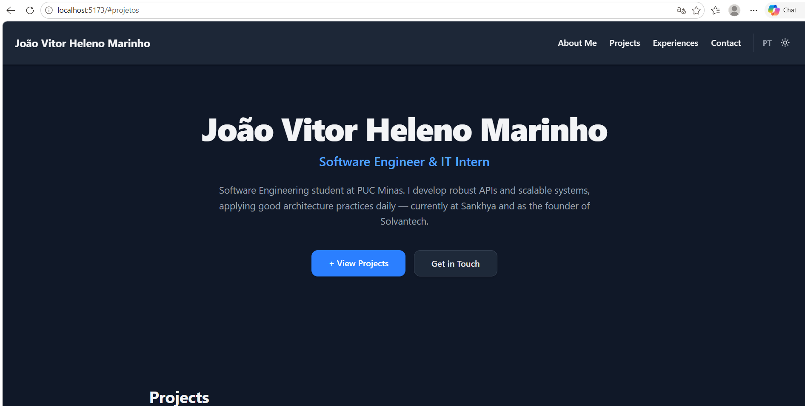

# Portfólio Pessoal - João Heleno

Um portfólio desenvolvido para apresentar nossos projetos, experiências e trajetória na área de computação

# Wireframe Inicial

## Tecnologias Utilizadas

Este projeto foi construído focando em performance e em um fluxo de desenvolvimento ágil:

*   **[React](https://react.dev/)**: Biblioteca base para a construção das interfaces e componentes.
*   **[Vite](https://vitejs.dev/)**: Ferramenta de build
*   **[Tailwind CSS (v4)](https://tailwindcss.com/)**: Framework CSS utilitário, configurado nativamente no Vite, garantindo estilização leve e rápida.
*   **[Lucide React](https://lucide.dev/)**: Utilizado para renderizar os ícones de forma limpa.
